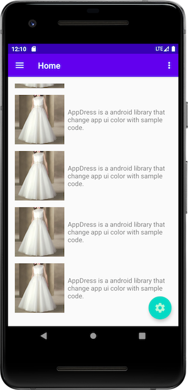
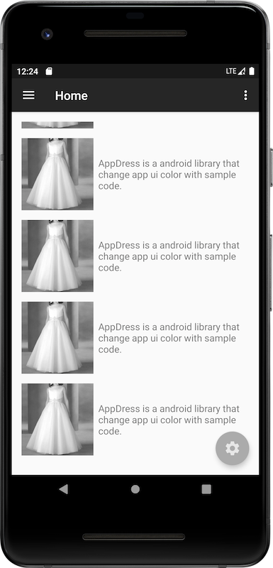
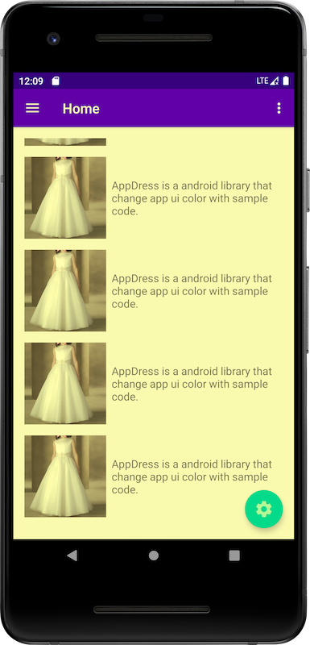
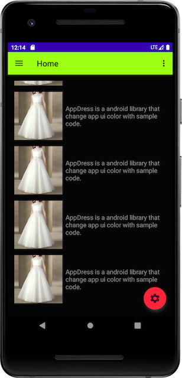

# AppDress

[](https://jitpack.io/#lenebf/AppDress)

AppDress is a android library that change app ui color with simple code. coextensive with [App 黑白化实现探索，有一行代码实现的方案吗？_Hongyang-CSDN博客](https://blog.csdn.net/lmj623565791/article/details/105319752)

**Implementation documentation**：[给App装上漂亮的裙子](https://juejin.im/post/6870900334714159111)

```java
case R.id.rb_gray: {
    AppDress.tint(new GrayColor());
    break;
}
case R.id.rb_eye_protection: {
    AppDress.tint(new EyeProtectionColor(0.3f));
    break;
}
case R.id.rb_night_mode: {
    AppDress.tint(new NightColor());
    break;
}
default: {
    AppDress.tint(null);
    break;
}
```




# Download

**Step 1.** Add it in your root build.gradle at the end of repositories:

```groovy
allprojects {
    repositories {
        ...
        maven { url 'https://jitpack.io' }
    }
}
```

**Step 2.** Add the dependency

```groovy
dependencies {
    implementation 'com.github.lenebf:AppDress:Tag'
}
```

# How to use

**1. SDK Init**

```java
public class DemoApp extends Application {

    @Override
    public void onCreate() {
        super.onCreate();
        AppDress.wear(this);
    }
}
```

**2. Tint the dress**

```java
// Gray mode
AppDress.tint(new GrayColor());

// Eye protection mode
// AppDress.tint(new EyeProtectionColor(0.3f));

// Night mode
// AppDress.tint(new NightColor());

// Original
// AppDress.tint(null);
```

**3. Exclude view when using night mode**

```java
// For Activity
public class MainActivity extends AppCompatActivity implements NightColorFilter {

    ......
    ......
    ......

    @Override
    public boolean excludeView(@NonNull View view) {
        return view instanceof ImageView;
    }
}
```

```java
// For single view
NightColor.revert(view)
```

# License

GNU General Public License v3.0. See the [LICENSE](https://github.com/lenebf/AppDress/blob/master/LICENSE) file for details.
